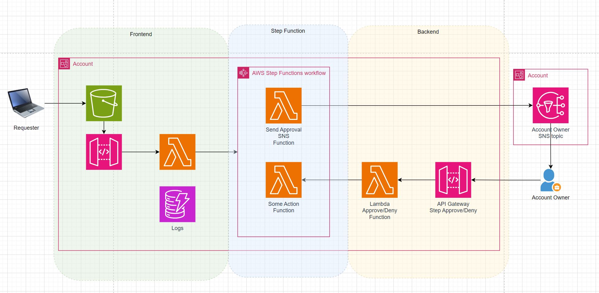

# API Gateway + Lambda + Step Function Human Approval Demo
This Terraform Solution deploys an application for human approval of access request. It consists of parent caller and 3 sub-modules (deployed in this order of operation):
1. Parent (where we call other modules above)
   - Create DynamoDB "log" table
   - Setup Cloudwatch permission in API Gateway for this account
   - Create SNS topic for "owner"
2. Backend Module
   - API GW that the owner clicks on to approve/deny
   - Lambda behind API to send response back to pending Step Function
3. Middle (Step Function) Module
   - Lambda to send notification to approver subscribed SNS topic
   - Lambda to take final action
   - Step Function action that writes to DynamoDB "log" table
4. Frontend Module
   - API GW where the requester send in their name and desired permission
   - S3 for UI
   - Lambda to receive, verify, and trigger Step Function

# ChangeLog
## 1.0.0 (07/14/2024)
- Intial

# Usage
- Need to provide value for 2 variables (either update vars.tf or bring tfvars file)
  - Your email address
  - Your IP address

# Room for Improvement
- Use CloudFront CDN instead of letting users go direct to S3
- Display a "confirmation" page when approver click on the link in SNS
- Change SNS Message to HTML so that the Approve/Deny link is easier to read
- Allow requester to submit multiple requests at oncen  
  - Can Step Function handle multiple human approval during same execution?
  - or use SQS to launch multiple execution of step function